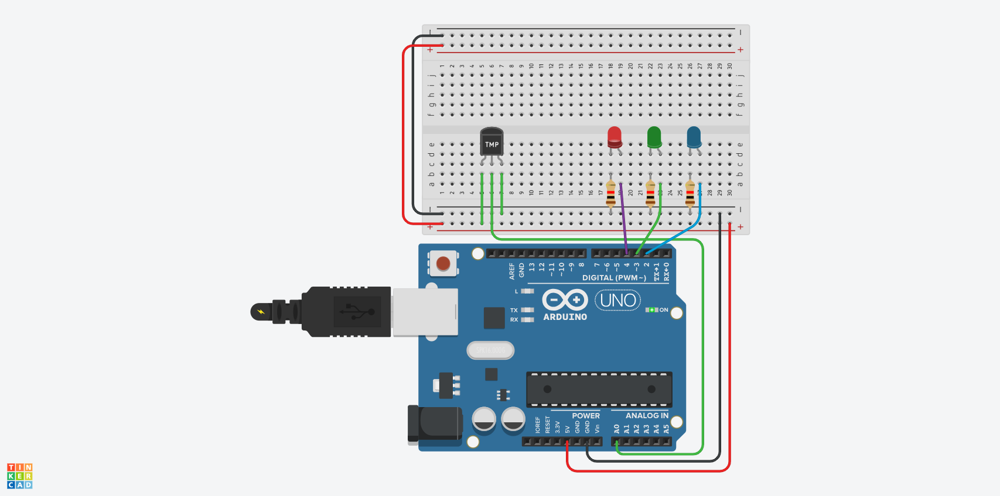

# 🚦 Arduino-Based Temperature LED Indicator (Hot, Moderate, Cold)

This project uses an **Arduino Uno** to read temperature data from a **TMP36 sensor** and control three LEDs (Red, Green, Blue) based on the current temperature. The colors indicate whether it’s hot, moderate, or cold.

---

## ✨ Features
- 🔴 **Red LED**: Indicates hot temperature (> 35°C).
- 🟢 **Green LED**: Indicates moderate temperature (25°C - 35°C).
- 🔵 **Blue LED**: Indicates cold temperature (< 25°C).
- Real-time temperature readings are displayed on the Serial Monitor.

---

## 🛠️ Hardware Components
1. Arduino Uno
2. TMP36 Temperature Sensor
3. Breadboard
4. 3 LEDs (Red, Green, Blue)
5. 3 Resistors (220Ω)
6. Jumper Wires
7. USB Cable (for Arduino)

---

## 📺 Circuit Diagram
Here is the schematic diagram for connecting the TMP36 sensor and LEDs to the Arduino:

---

## 📋 Circuit Connections

### TMP36 Temperature Sensor
- **VCC (Pin 1)**: Connect to the 5V pin on the Arduino.
- **OUT (Pin 2)**: Connect to the analog input pin A0 on the Arduino.
- **GND (Pin 3)**: Connect to the GND pin on the Arduino.

### LEDs
- 🔵 **Blue LED**:
  - Positive leg (long leg) connects to digital pin 2 through a 220Ω resistor.
  - Negative leg (short leg) connects to GND.
- 🟢 **Green LED**:
  - Positive leg (long leg) connects to digital pin 3 through a 220Ω resistor.
  - Negative leg (short leg) connects to GND.
- 🔴 **Red LED**:
  - Positive leg (long leg) connects to digital pin 4 through a 220Ω resistor.
  - Negative leg (short leg) connects to GND.

### Power and Ground Connections
- Use the **red rail** on the breadboard for the 5V power supply from the Arduino.
- Use the **black rail** on the breadboard for the GND connection.

---

## 🖥️ How It Works
1. **Temperature Reading**: The TMP36 sensor outputs a voltage proportional to the ambient temperature, which the Arduino reads via analog pin A0.
2. **Temperature Conversion**: The analog reading is converted into a temperature value in Celsius using a mathematical formula.
3. **LED Control**:
   - If the temperature is less than 25°C, the Blue LED lights up.
   - If the temperature is between 25°C and 35°C, the Green LED lights up.
   - If the temperature is greater than 35°C, the Red LED lights up.
4. **Serial Monitor**: Temperature readings are printed in real-time to the Serial Monitor for debugging or monitoring.

---

## 🔧 How to Use
1. Assemble the circuit on a breadboard as described above.
2. Connect the Arduino Uno to your computer via USB.
3. Open the Arduino IDE, copy the code from the `main.ino` file, and upload it to the Arduino board.
4. Open the Serial Monitor in the Arduino IDE (set baud rate to 9600).
5. Observe the LEDs lighting up based on the current temperature.

---

## 📂 Code
The full source code for this project can be found in the file [`main.ino`](./main.ino).

---

## 🌟 Applications
- Temperature monitoring in small spaces.
- Educational demonstration of sensors and Arduino.
- Visual indicators for critical temperature thresholds.

---

## 🛠️ Troubleshooting
1. **No LEDs are lighting up:**
   - Check all connections and ensure they match the diagram.
   - Verify that the TMP36 is correctly connected (VCC, OUT, GND).
2. **Incorrect temperature readings:**
   - Ensure the TMP36 sensor is working properly.
   - Confirm that the TMP36 is receiving 5V power.
3. **Serial Monitor not displaying data:**
   - Make sure the correct COM port is selected in the Arduino IDE.
   - Ensure the baud rate is set to 9600 in the Serial Monitor.

---

## 📝 License
This project is open-source and licensed under the [MIT License](LICENSE).

---

## 👤 Author
Created by [Your Name]. Feel free to contribute or suggest improvements to the project!
